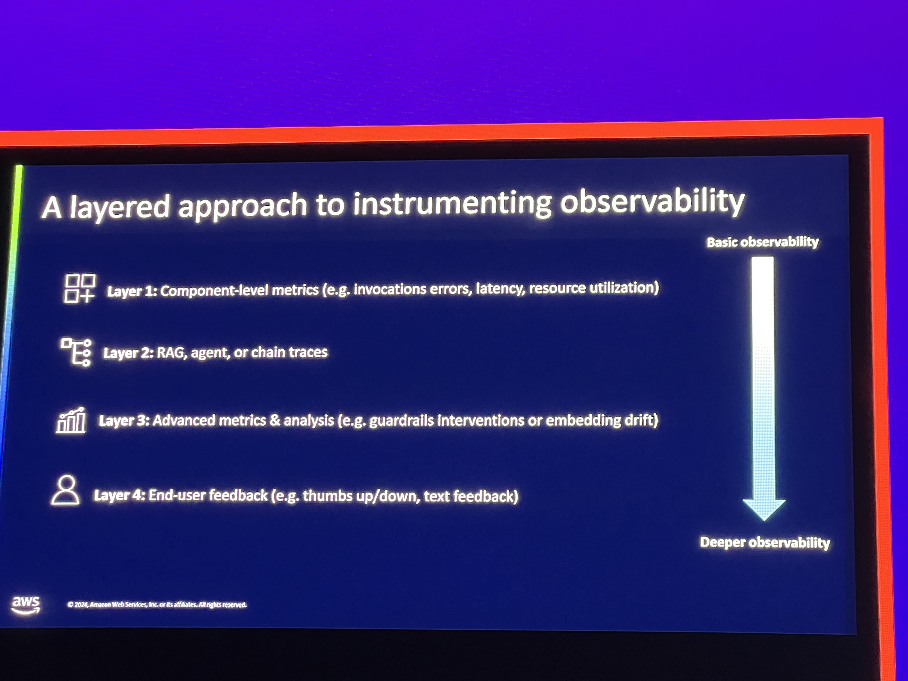

# Best practices for generative AI observability
Hard to get GenAI right in production for many reasons. One of which is the ability to do proper observability. One of the challenges is that logging and trace scope are hard to follow as you reach each component of an application. it's a difference span between the API Gateway, lambda and S3 bucket.

## Capabilities of Discussion
Guadrails - They are separate APIsfrom Bedrock now and can be run against any model that's deployed. Ability to use consistent metrics to observe any potential malicious language in models deployed within the environment.

AWS Bedrock capability - Contextual Grounding and relevance

Cloudwatch Embeded Metric Format - THis is a specific way to set up a log so that its structured a specific way that allows you to extract metrics from a log.

Missing data treatment - WHen setting an alarm you can set up how to address missing data. Decide if it's good thing for nothing to be sent back or if it's bad.

## Levels of observability

## Logs, Metrics, and Traces

Logs - Provides information of "the input prompt and generated outpust by the user were"
Metrics -  Provide the insight of "the prompt to respnse latency has increaced by 35%"
Traces - Allows insights into "What is the distribution of processiing time across RAG"

## Composite alarms
Allows you to drive more intelligent alarms and eventually can be used to drive automated changes or adjustements as there are patterns that identified by the 

## Model invocation logs
Needs to be enabled by you but allows you to understand how, when a model is being used. Can this be aggregated so that there's visibility from the AWS Observability platform?

## Big Idea
Creating code that will create spans for product to be able to set up appropraite spans that can help identify calls and traces...do we need to do this with Dynatrace? How can we find a way to use Dynatrace to do some of this? Should we create code for Lambdas, containers, models, etc?

## References
https://docs.aws.amazon.com/AmazonCloudWatch/latest/monitoring/aws-services-cloudwatch-metrics.html
https://aws.amazon.com/blogs/machine-learning/introducing-guardrails-in-knowledge-bases-for-amazon-bedrock/
https://docs.aws.amazon.com/sagemaker/latest/dg/monitoring-cloudwatch.html
https://docs.aws.amazon.com/AmazonCloudWatch/latest/monitoring/CloudWatch_Embedded_Metric_Format.html
