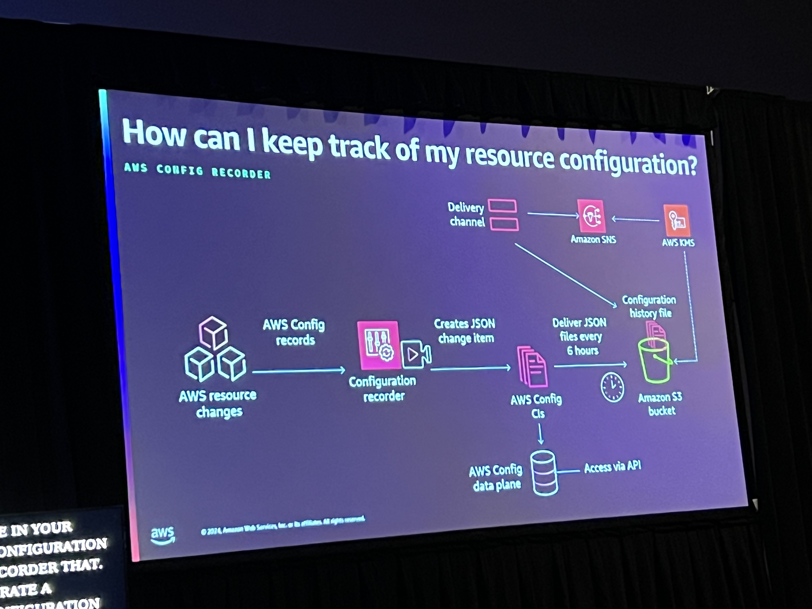
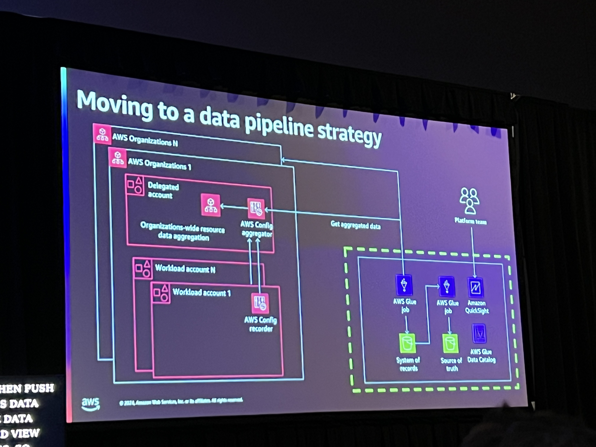
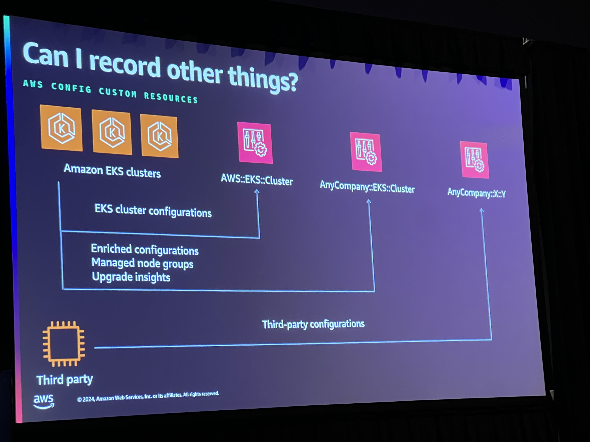
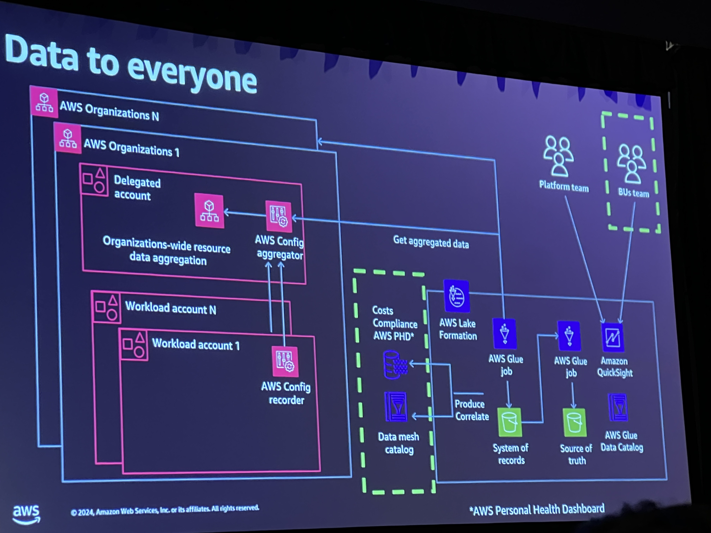
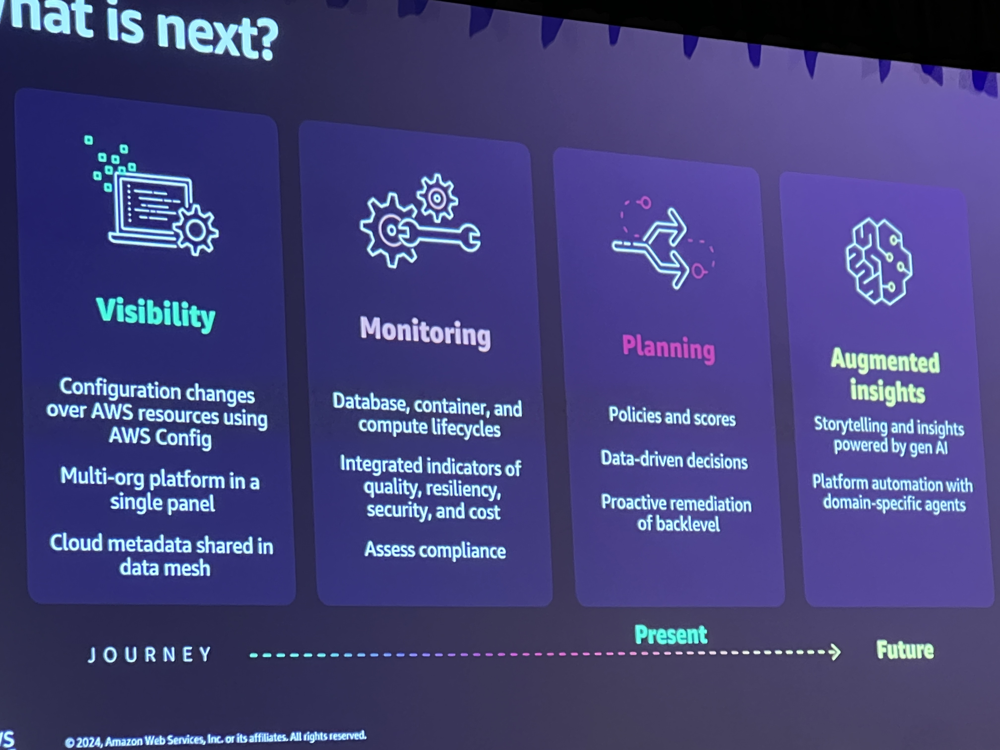

# Unlocking business insights with AWS Config

## Customer Challenges
- Dynamic landscape
    - This can mean that you may have many AWS best practices at scale within the organizations.
    - Now we need to know how many resources we have and who is the owner. And need to know what's in compliance versus what is not.
- Continous governance and compliance
- Environment changes

## Major Theme: Research Configurations At Scale
Resource configuration that shows relationship, size, network, and security of the resources.

Metadata of the Configuration item that tells you when things have changed
The Attributes lets tyou know the state and status of the resource
The relationships you are able to see the relationships between the resource and potentially other
Current configuration we are able to see of the resource as well

### AWS Config Recorder

### Abiility to add your own data create your own CIs!
Creating custom resource configuration items with the cloud formation registry which we can create the custom schema for the resource and then push the CI out across the organization

### Config Aggregator
It's a read only vie of data that you collect with config. You can create many aggregators and have different aggregators for account level and ones for the organization.
Recommendation to have a org aggregator account or the delegated administrator.

### Advanced Query
This allows you to use SQL statement queries on top of aggregators. Allows you to gather data that actually means something or answers specific business questions. 

Be able to exlcude IAM roles because they are global no need to add them to regional aggregations

### Use case
Noticed that a company had 5 different Organizations. What is the determination that there's needs to be more than one organization?

## Resources
https://aws.amazon.com/blogs/mt/org-aggregator-delegated-admin/