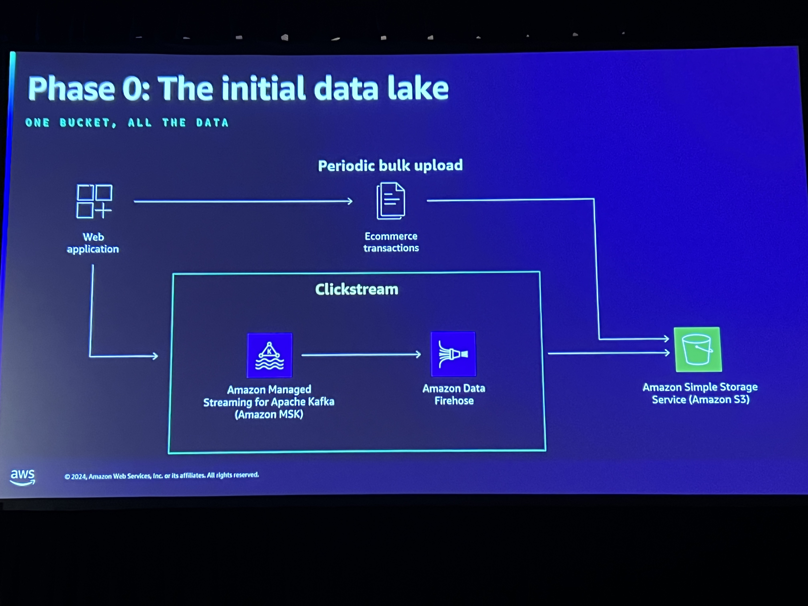
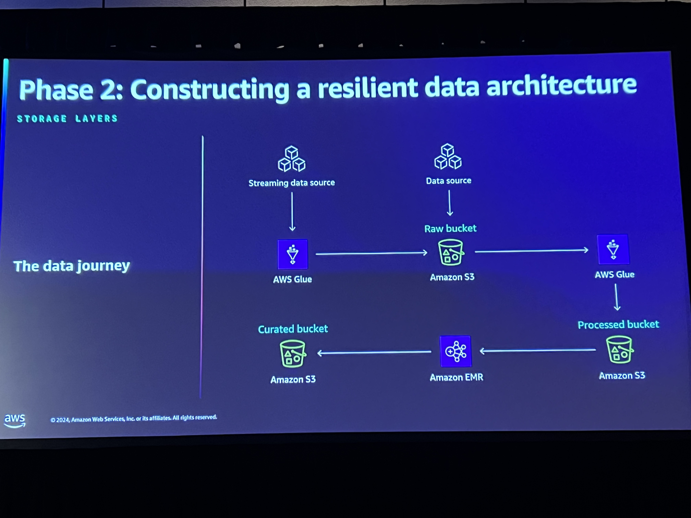
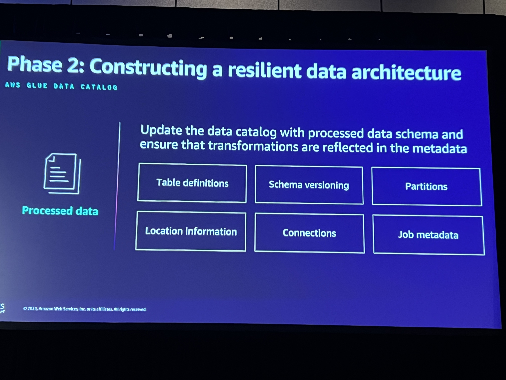
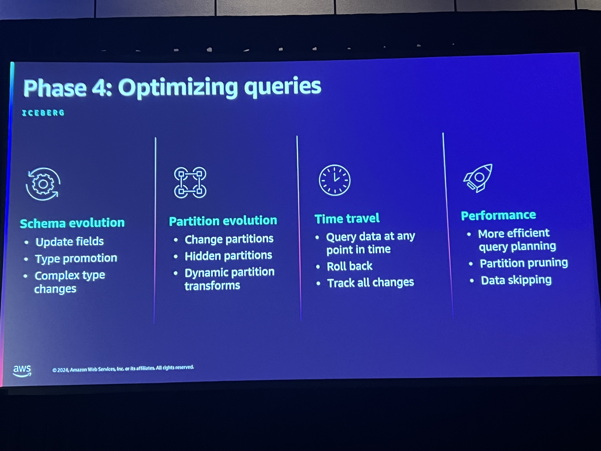
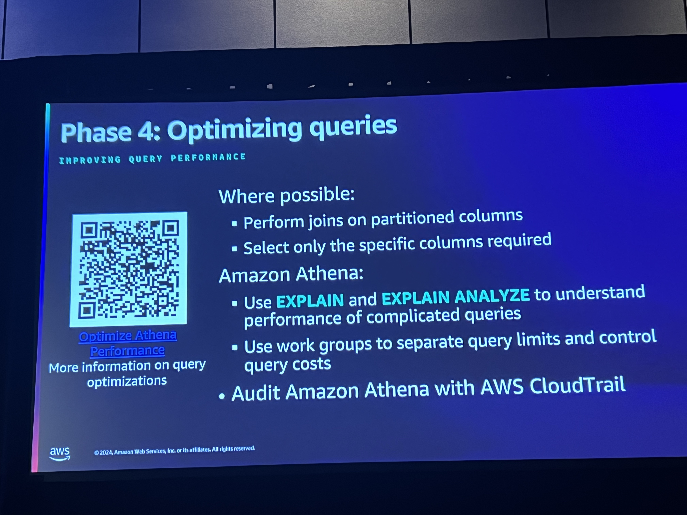
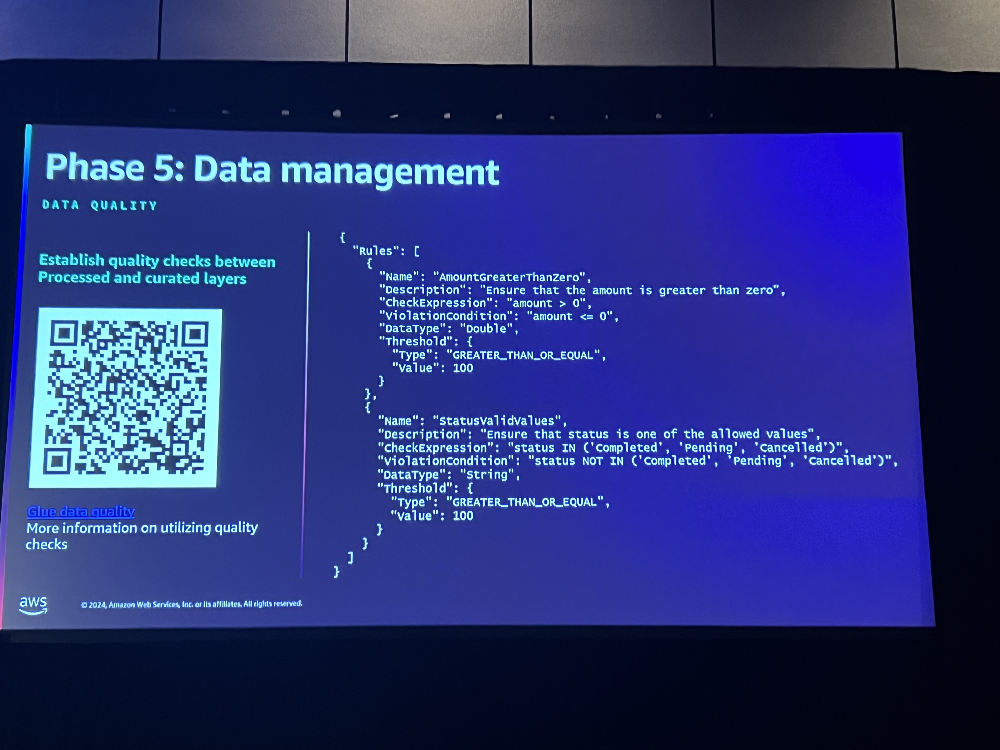
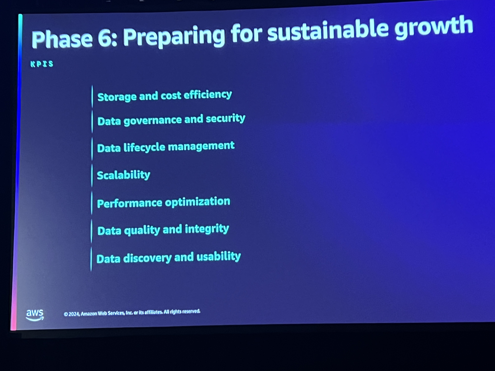

# Build and optimize a data lake on Amazon S3

### Realization
The biggest challege is managing huge data growth and still provide appropriate performance and governance around access to data and costs.

### Constructing a resilient architecture

IN this section we walked through the data architecture and phases of data tables. Started with Raw, then procesed and lastly curated. Raw Data, or Bronze Data are coming directly from the source. 

Want to make sure to account for prefixing so that they can scale. There are certain limits to access the data stored at a particular prefixes. Mentioned a service call Iceburg? Discussed the ability to use a Glue Crawler to identify new data schemas.

For processed data you aggregate that from raw data formate and store in parquet format. This gives you good compression for storing data. But for columnar requirements we may need to store in a dfferent format. If youre using iceburge there's a metadata that allows you catalog the data files according to the partion. Expire data snapshots so that it cleans.

For curated tables they must be well documented and very structured specifically for business use cases. These things can be stored in S3 otr in a data warehouse.  They should be registerd in AWS Glue data catalog...or whatever the data catalog is that we are 

### Data security and governance

This section they introduced a service called Amazon DataZone which will help with the people access management of data in the data catalog. This section also included information about a data mesh. A data mesh should shift the data ownership to the business or for the operational data lake that's owned by the AWS Core team and we are able to determine who has access to what data and when. This creates a situation where data is a service from the core team. 

Used Lake formation to introduce fine grained access control to data. Data zone allows us to define domain for specific data and inside that domain we have multiple catalogs in side of that. Data zone is multi account and cross account capable.Data zone is also able to track data lineage and enabled carefully currated tags.

Datalakes are multi account constructs. Your analytics account may be a separate account from the areas where your raw data storage is.

### Optimizing queries
Limit your queries to partitions and ensure that you have compressed data. Look into the use of Zstd. This is where we reference the Iceberg capability

Use of redshift is something that could be done with the spectrum and S3 tables capability to help us understand what compute we need for executing our queries that are all over the place.

### Data Management

highlighted how you can control Glue to determine to do with missing data. Setting up alarms for specific data quality degradation.

For storage of the data, consider using the S3 lifecycle policies to ensure that you manage time to retain data for compliance and still keep costs predictable.

### Preparing for Sustainabe growth
Here the important messages were:
- Collect logs from all piece of your data pipelines and your databases.
- Make sure you have set up alarms according to what is critical for you.
    - Data quality and integrity metrics
    - Data availability and performance metrics
    - Storage and cost management metrics need to be captured
    - And ensure you have security and compliance metrics.

