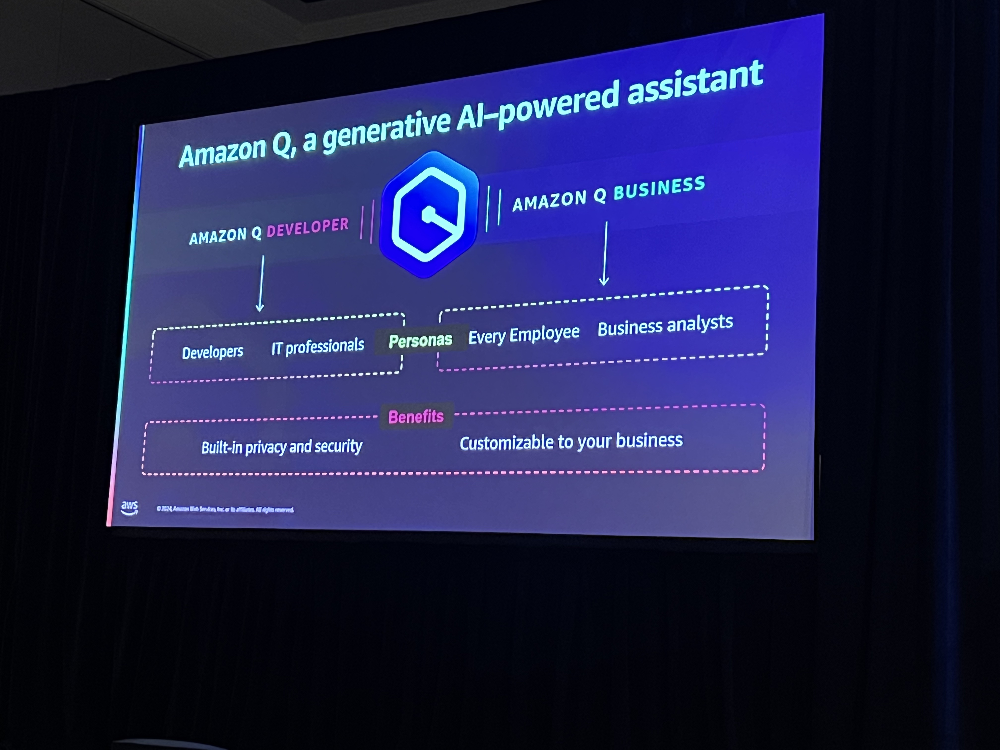

# Intelligently automate cloud operations

## AWS Trusted Advisor
Home to show what the AWS best practices are 

## AWS Health
Gives visibility into the performance and events that will impact the resources in your account.

## CloudWatch Anomaly Detection.
Allows you to use a model that helps you learn about your trends for your resources and help you to find things that are out of the establish baseline

## Amazon Devops Guru 

## Amazon Q Developer and Business

## Automation best practice
- Define contxt reference resource using taging and standard naming conventions
- Least Privilege means thing should only have one reason and given permissions for what it's supposed to do
- Use Event driven strategies as much as you can so that you're not spending resources on polling an enviornment frequently
- Think serverless so that we can be as light weight and focus on the capabilities and not all of the maintenance 
- Implement circuit breakers by making sure if there are some unintentional changes in your automation that allows you to rollback easily with minimal impact.

## Resources
https://catalog.workshops.aws/event/dashboard/en-US/workshop/lab02/step3

## Key Takeways 
Using alarms will help with significantly create means to automate rollbacks in the case a recent deployment begins to have failures. This will help us to roll back to a previously known functional version of our application if we are able to ensure that the pipelines for both the infrastructure and the source code are deployed in the proper sequence.

Performance testing can also be done in aws and allows you to be able to do a level of load testing in the AWS Console. 

PUt a stage in the CI/CD pipeline that does a execution of the performance/load testing testing 
Make sure we make some clear recommendation on how we do weighing of the traffic being pushed to the new deployments slowly.
We also need to make a clear recommendation on what the preferred behavior (rollback, etc.) is for the application in the case the new version of an application version. Understand that if it's an issue with production and you are looking to find a solution for it rollback may not be the right decision.