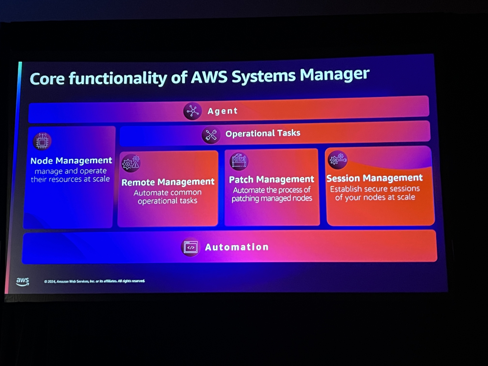
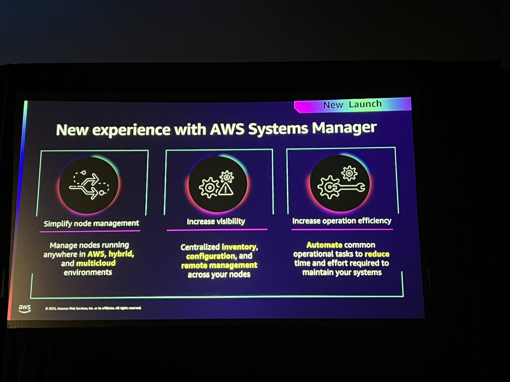
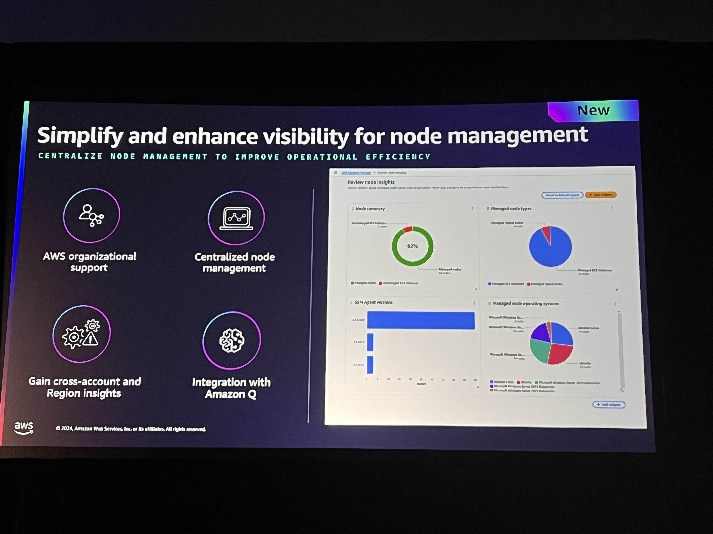
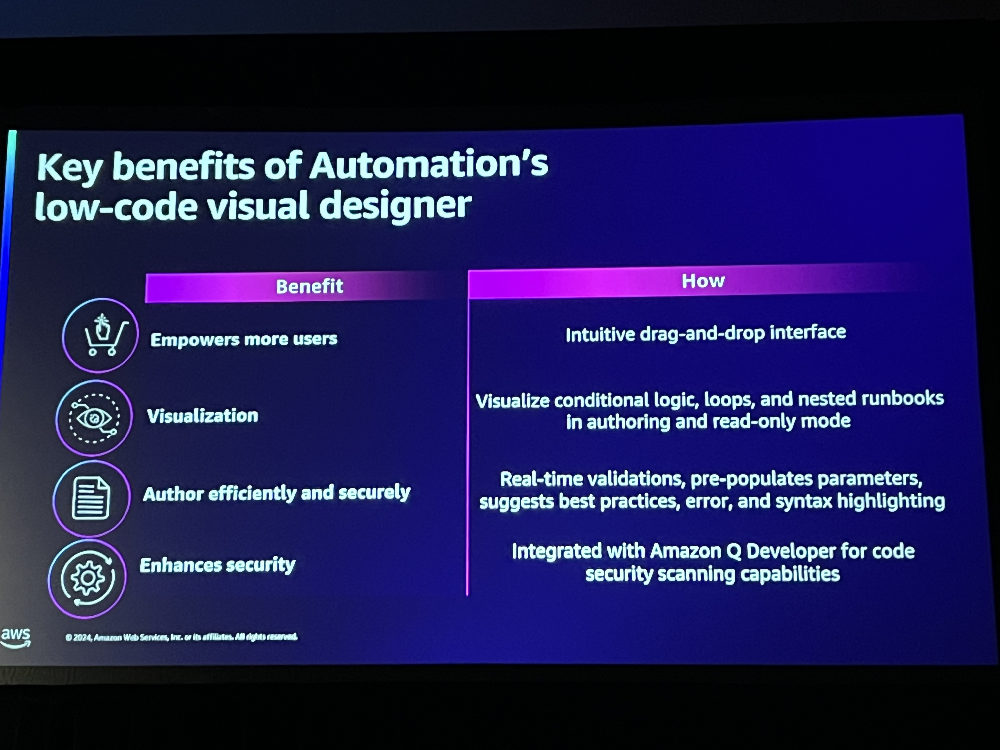

# Scaling IT with the next generation of Systems Manager
There are 22 different services in SSM. There was a period that everyone has to do all of the work internally in order to put them together in a way that fit according to the organization.

## Journey
2015 was the start of the service with a focus on managing EC2 resources. The focus was on central operations activities like patching, inventory, and troubleshoot issues. 

Today SSM manages 450 Million Nodes and 2.5 billion automation scripts. They have added hybrid operations capabilities and introduced capabilities to improve scalability.

## Next Generation of AWS System Manager

## Building an operations foundation
Goals
- Simplfy deployment
- Maintain organization infrastructure
- Automate compliance

Launched Automation runbook builder - that allows you to drag and drop to build different things that need to be done to manage VMs. Allows us to have security run books or compliance runbooks available for us to use out of the box without having to do a significant amount of work 

## Key takeaways
- One click set up for SSM now.
- Enable the Diagnose and remediate capabilities for managed nodes. This way we can get away from using third party tools.
- Automate operations once nodes are onboarded.

## Resources
https://aws.amazon.com/blogs/aws/introducing-a-new-experience-for-aws-system-manager/
https://catalog.workshops.aws/getting-started-with-com/en-US#welcome

