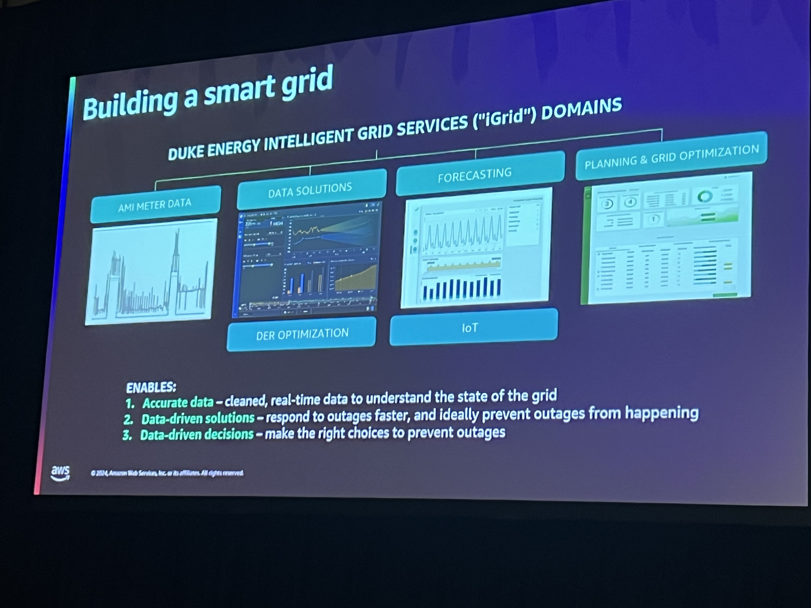
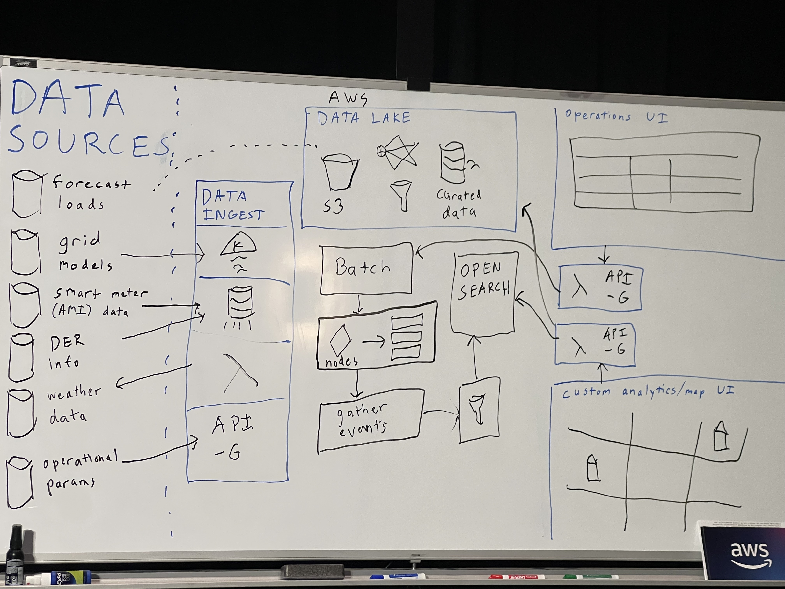

# Architecting advanced distribution grid planning for Duke Energy

This was a session lead by Scott Peters from the Duke Energy iGrid development team. This was an exciting session to see something we support get this type of attention and presented in the way it actually works.

Integration Planning Is valuing all resources based on tehir fuctional capabilities regarldess of their location.
Theres multiple parts of the Duke Grid. Generation, transmission, Customer and more.

Discussed the importance of advanced distribution planning so that we are prepared for variations and changes in energy production, changes in the workforce which requires knowledge spanning generations and more.

AWS has a plan for a dynamic grid to ensure that there's enough power on teh grid and that energy is distributed efficiently regardless of other environmental factor.

Learned that the Grid Host capacity site has a publically available site and that it's used by companies like Tesla and allows account managers and developers to assess quickly if they're able to support whatever they need to support from a load perspective on the land they're interested in.