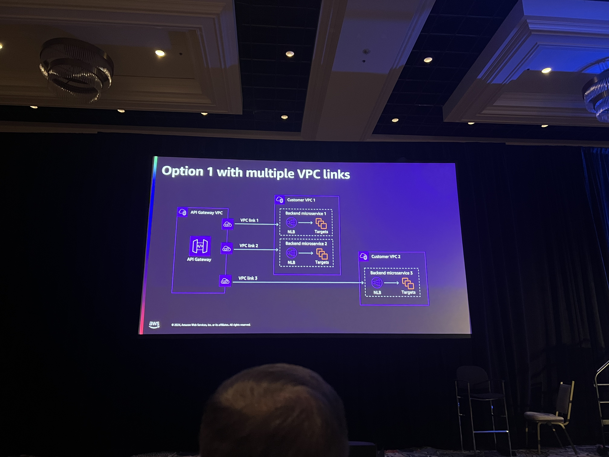
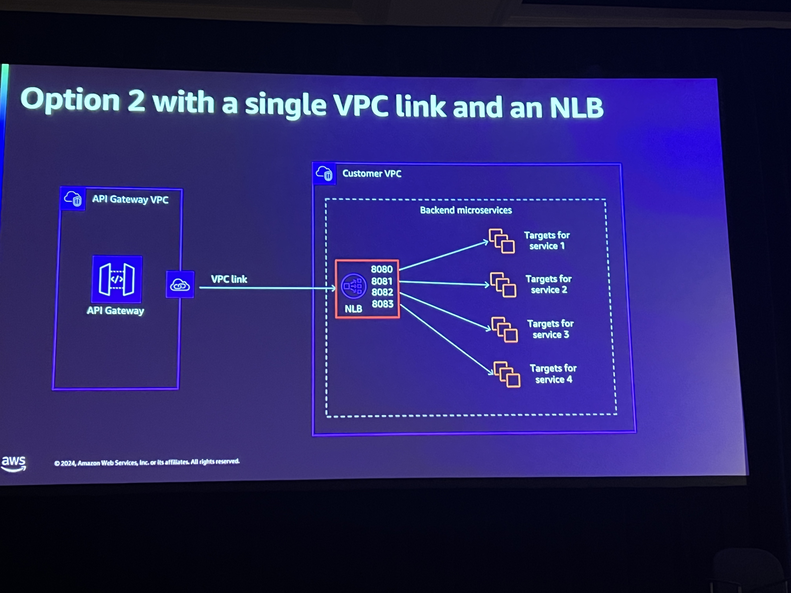
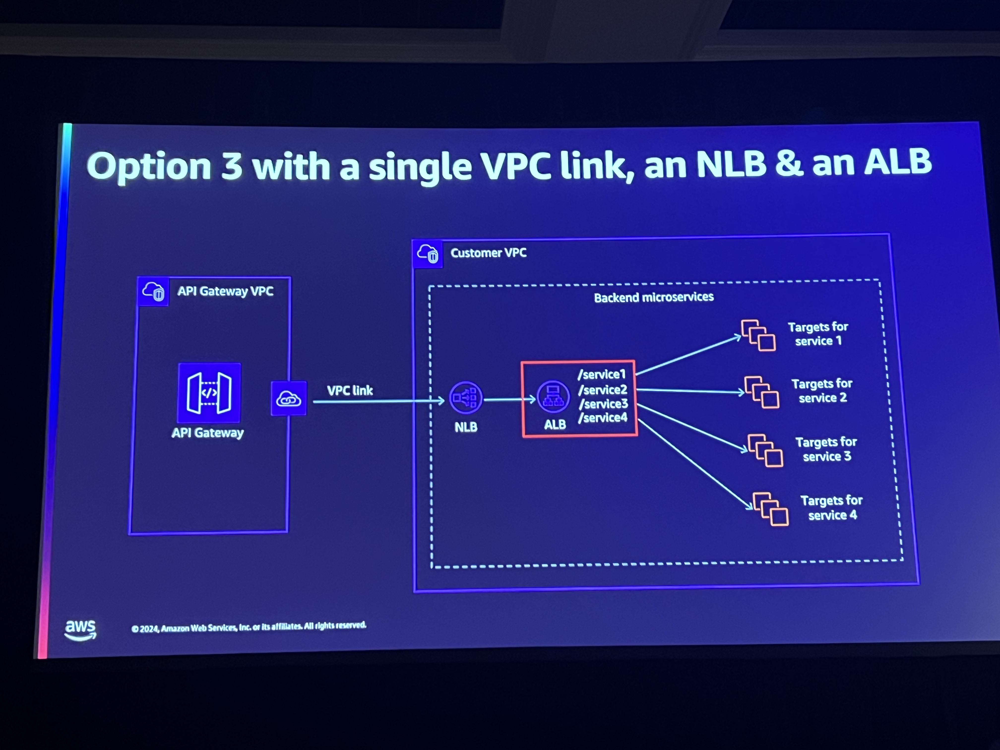
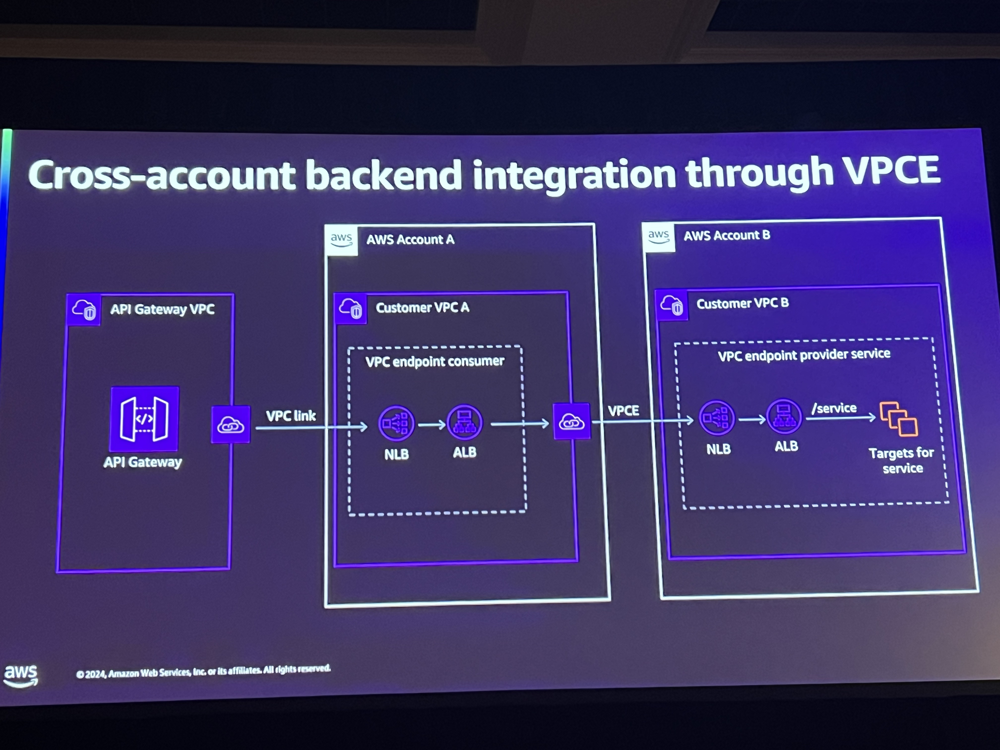
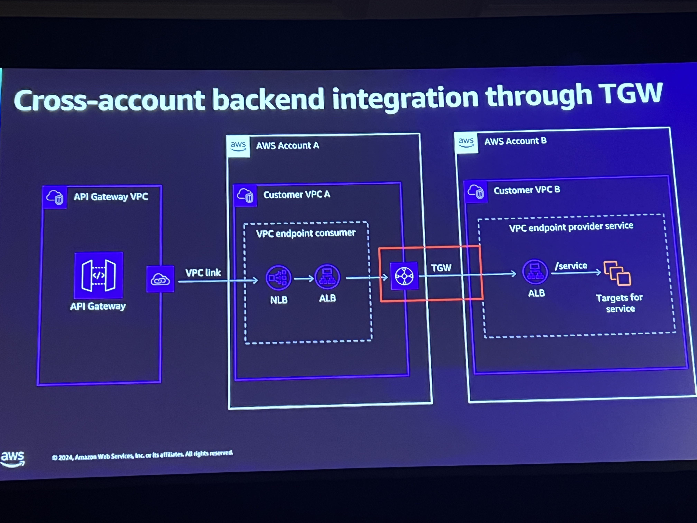
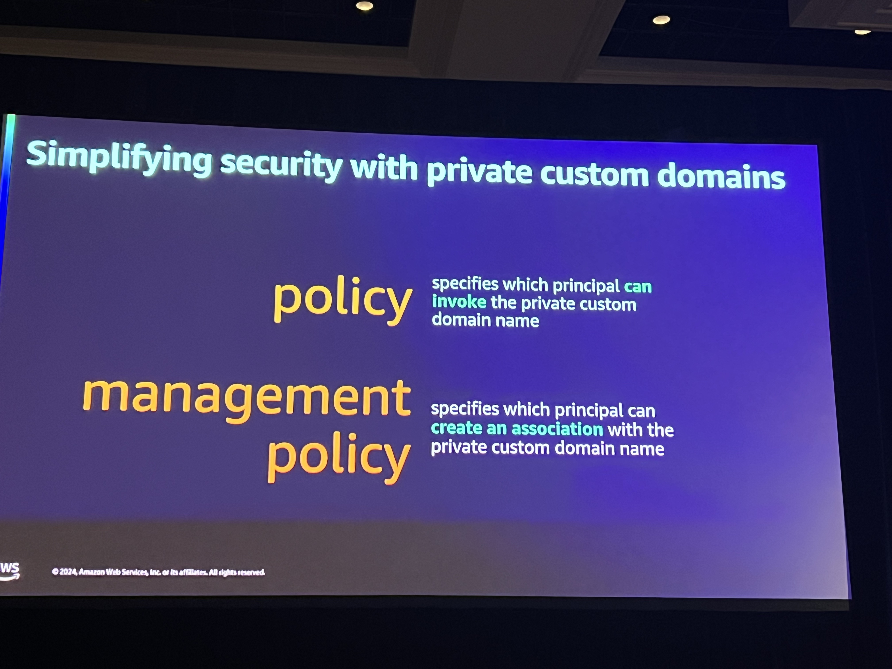
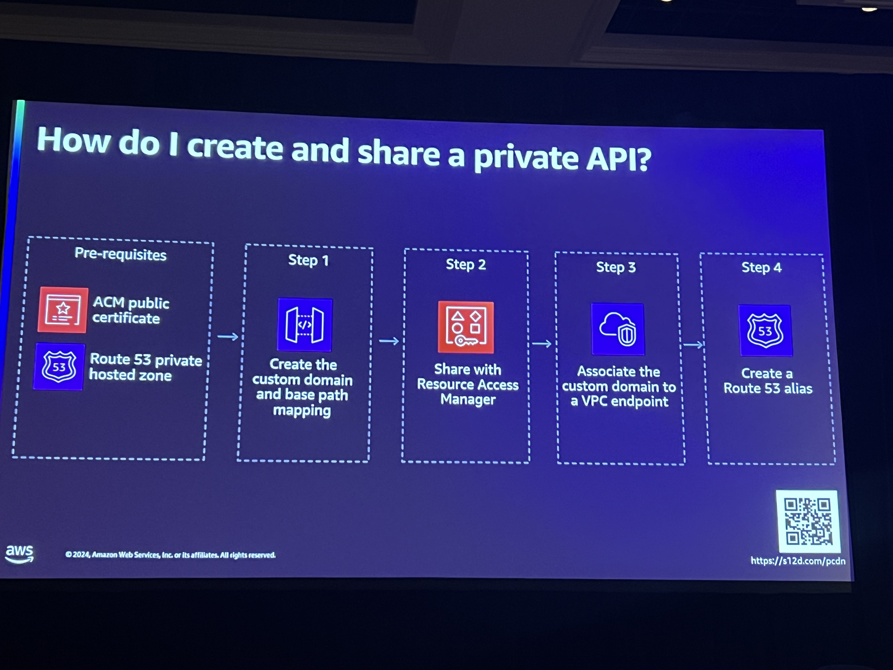

# Scaling and securityprivate workloads using Amazon API Gateway

Much of this is kind of assuming that there is a single API gateway fronting all of the services across the organization. Is that feasible?

## Patterns
Began discussing how you may have service running in a variety of account across and organization. And each of them operates in their own accounts and within their VPC. Each of those accounts being attached to a transit gateway. And provided 3 options for how you serve up the services across your organization

### First with multiple VPC Link
API Gateway will use the VPC Link wrapper for a network load balancer that fronts the backend services. A VPC link from multiple VPCs can be done on the same API Gateway.

### Second with Single VPC Link
With the use of one VPC link you'll still have the VPC Link being reference by the API Gateway but instead of having more NLBs, you have a massive NLB that will have router rules that associate specific ports to specific target services behind it.

Down side to this there are limits. This still only gives us Layer 4 level routing.

### Third options with an ALB behind NLBs
This give now gives us some layer 7 level routing capabilities

Still need to configure the NLB to listen for the ALB

### Cross Account backend integration through VPCE
This give you a shared services account A that acts as the massive routing account and then you have VPCE set up between Account B- Z that allow you to readd the NLB > ALB within the B-Z accounts

### Cross Account Backend integration with TGW
This would be traversing the TGW instead of using a VPC endpoint given that you have a significant amount of ability to reference services across the organization and have a singular API gateway for all of them or you can hav e a single API gatway per line of business and then use each of those reference the approrpriate back end services throught this pattern as well 

# Having private DNS enabled vs not
Here we discussed the pros and cons of having the Private DNS so that routing resolves to the IP addresses within the VPC. What the URLs look like when they are the private APIs they're not the easiest to navigate.

## Best Practices before introducing the big news
- Consider the Soft quotas for VPC Links is 20. If this is enough, great if not...move to the NLB/ALB pattern
- NLB and ALB have a significantly higher quotas to allow for scale, but still has limits.
- API GW policy character limits are also a thing Think 8,100+ characters
- Still use VPC endpoints that are protected by a security group and use VPCE policy to only allow traffic from the APIGateway.

## Big News
PRIVATE CUSTOM DOMAINS ARE LIVE!

## Resources
https://aws.amazon.com/blogs/compute/implementing-custom-domain-names-for-private-endpoints-with-amazon-api-gateway/